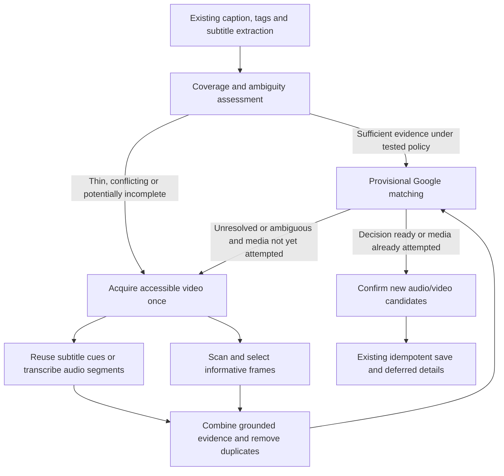

# Mapd: selective audio and video evidence — implementation plan

Drafted and reviewed September 20, 2026. Implementation progress and evidence are recorded in [the September 21 report](engine-multimodal-implementation-report-2026-09-21.md). This is the frozen scope/checklist; production activation is not implied. The report distinguishes completed local engineering from operational and real-corpus gates.

User decision: start with **GPT-4o mini Transcribe**, keep transcription providers interchangeable, balance accuracy against cost, and keep all spending controls **observation-only**. This plan extends the September 18 reliability/cost work; it does not replace or undo it.

## 1. Outcome and boundaries

Recover places named only in speech or visible briefly in a video, including additional venues omitted from a multi-place caption. Preserve source evidence, uncertainty, privacy, existing saved pins, and explicit retry semantics.

Initial scope: accessible public Instagram/TikTok videos and YouTube only where the existing language/source feature supports it. Existing captions, tags, subtitles, carousel analysis, Google matching, selection, and deferred details remain the baseline. No guarantee of identifying every video or bypassing private/deleted/blocked media. No proxy rotation or alternative reader after a provider rate limit.

The initial pilot requires confirmation for places newly recovered through audio/video. Existing well-supported baseline candidates retain their current behavior unless new evidence contradicts them. Improving automatic saves for the new modalities is a later measured rollout decision.

Out of scope: UI/theme redesign, new mobile build, historical reprocessing, new automatic retry behavior, Google details expansion, model-provider failover after an ambiguous dispatch, live-video streams, and monetary spending enforcement. New transcription/vision calls are server-side only.

Execution baseline: server `/Users/alexlin/workspace/mapd-server-next` at `dd145e7`, app `/Users/alexlin/workspace/mapd-next` at `9b1d485`, both with existing uncommitted work. Preserve all current reviewed changes. These are local observations, not deployed-version claims. Prior backend/rules deployment remains a separate prerequisite to verifying production behavior.

## 2. Provider choice and cost decision

- Initial adapter: OpenAI Audio Transcriptions, `gpt-4o-mini-transcribe`; propose pinning the documented snapshot `gpt-4o-mini-transcribe-2025-12-15` for reproducible evaluation. Verify that snapshot is available to the project before pilot activation. Never silently substitute another model.
- Keep the current Haiku vision/extraction model initially so the experiment isolates new evidence. Provider selection is trusted server configuration, captured per attempt and included in cache identity.
- GPT-4o mini Transcribe is a speech model, not the general GPT-4o mini chat model or a ChatGPT subscription. Use a server secret `OPENAI_API_KEY`; do not put it in Expo or mobile configuration.
- It does not expose word timestamps through `timestamp_granularities`. Return honest segment time windows from our own audio chunking; do not invent word timing or switch models implicitly to obtain it.
- Wispr remains a potential adapter after obtaining approved API access, pricing, and a suitable fidelity contract. It is not an implementation dependency.

Published estimates checked September 20, 2026:

| Transcription option | Approximate price per 1,000 audio minutes | Decision |
| --- | ---: | --- |
| GPT-4o mini Transcribe | $3.00 | Initial provider requested by user |
| Groq Whisper Large v3 Turbo | $0.67 | Future cost/accuracy challenger; $0.04/hour with a 10-second minimum per request |

Groq is about 4.5 times cheaper on these rates, but the difference is about $23.33 per 10,000 processed minutes, before overlap, minimum billing, and additional processing. Keep the requested baseline while recording the crossover: at 100,000 minutes the approximate difference is $233.33. Benchmark a cheaper adapter before adopting it; the price comparison does not establish venue-name accuracy. No runtime switches based on spend.

Audio cost is approximately `submitted_seconds / 60 * $0.003` for planning, including overlapping chunks. Actual token usage and invoice reconciliation take precedence over that estimate. Add vision, extraction, Google searches, media transfer, CPU/storage, and operational reads separately. Cache hits/shared followers are not new physical calls. Missing usage stays unknown, never zero. Do not double-count audio tokens and the duration estimate.

Sources: [OpenAI pricing](https://developers.openai.com/api/docs/pricing), [model snapshots](https://developers.openai.com/api/docs/models/gpt-4o-mini-transcribe), [transcription formats and timestamps](https://developers.openai.com/api/docs/guides/speech-to-text), [Groq transcription pricing and limits](https://console.groq.com/docs/speech-to-text), [Wispr access](https://wisprflow.mintlify.app/quickstart), [Wispr billing](https://api-docs.wisprflow.ai/usage_billing). Recheck rates/model availability at implementation; this is not an invoice forecast.

## 3. Current integration points

| Existing file or area | Current behavior and required extension |
| --- | --- |
| `enrich.js:runAIPipeline` | Text extraction and carousel vision, then matching. Add a thin call into a separate video-evidence coordinator before final matching. |
| `lib/extraction.js`, `lib/instagramReel.js`, `lib/ytdlp.js` | Metadata/subtitles only; Instagram HTML success skips yt-dlp. Preserve media availability separately from text availability and expose only validated internal media descriptors. |
| `lib/ytdlp.js` subtitle parser | Flattens cues today. Retain cue offsets/provenance where available while keeping the legacy string for old callers. |
| `lib/publicFetch.js` | Public DNS validation/pinning and redirect checks, but a 2 MiB buffered metadata path. Reuse safety primitives in a separate streaming downloader; do not globally increase this limit. |
| `lib/vision.js` | Carousel URL acquisition and vision. Add a separate validated local-frame entry point and video prompt; preserve carousel behavior. |
| `enrich/ai.js`, `enrich/confidence.js` | Candidate extraction and Google ranking. Add validated evidence references and conservative decisions for new modalities. |
| `lib/sharedAiOperation.js`, `lib/sharedAiIdentity.js`, `lib/sharedAiStore.js` | Existing durable physical-dispatch authority, caching, privacy scope, and caller subscriptions. Reuse for each ASR chunk and vision/extraction request. |
| `lib/providerRuntime.js`, `lib/providerCooldown.js`, `lib/jobContext.js` | Provider leases, cooldowns, cancellation, deadline, and ownership. Extend rather than bypass. |
| `lib/engineFeatures.js`, `lib/engineRuntimeConfig.js`, `lib/engineVersion.js`, release manifest | Feature snapshots are strict v1; `mediaPilot:false` is descriptive only. Add a real, backward-compatible feature contract. |
| `lib/engineMetrics.js`, `lib/engineBudget*.js` | Existing provider/token registries omit OpenAI/audio dimensions. Extend estimates and observations without enabling enforcement. |
| `lib/labeledEvaluation*.js`, corpus/evaluation scripts | Strict v1 corpus contracts, no real media corpus in the repo, scorer consumes separately generated predictions. Add media assets, a prediction producer, and modality-specific measurements. |

## 4. Processing flow and invariants



- A shared-link attempt owns every side effect. Recheck cancellation/lease ownership before dispatch, result consumption, and save. Killing the app, a late result, cache expiry, cooldown expiry, or spend observation never revives a failed/dismissed attempt.
- Matching can be provisional: pre-match evidence triggers run first; otherwise weak/ambiguous Google results can trigger one media pass before any commit. Reuse unchanged searches, recompute changed/conflicting candidates, and never recurse from final matching into another media pass.
- An ASR timeout after dispatch is potentially billed. It is not permission to dispatch to another provider or repeat the same chunk. Only an explicit new retry can authorize another generation; successful evidence may be reused.
- Failure in one modality must preserve validated results from others. Distinguish unavailable, unattempted, partial, and successfully processed evidence. Finishing a sampled-frame pass never proves that every venue in the video was found.
- Names, cities, and branch claims require actual supporting evidence. Hints supplied to ASR are not an independent second source. Do not infer a branch from the user's home location or merge same-name branches without geography/identity support.
- Public scope comes only from server-fetched public evidence. Private share text/notes remain user-scoped. Evidence text is untrusted data, never instructions or an arbitrary download URL.
- Keep `engineVersion.schema`/selection schema 2 compatible. Large transcripts, frames, source-media URLs, and internal provenance do not go into mobile job/selection payloads.

## 5. Contracts and initial operating defaults

New modules should expose validated JSDoc/TypeScript-style public contracts, remain focused, and stay under 500 lines each. Paths below are proposed unless listed as existing above.

`lib/media/evidenceContract.js` defines:

- `MediaDescriptor`: trusted source/content identity, origin/platform, accessibility, bounded duration/format metadata, internal rendition references and expiry. No caller-supplied headers/cookies. Availability can be unknown before acquisition.
- `TranscriptEvidence`: provider/model/version, source media and chunk hashes, original-language text, nullable language, segments `{startMs,endMs,text,timing:'chunk'|'native'}`, submitted duration, covered intervals, and structured failures. Segment times must be within the actual clip; overlap is represented, not counted as additional coverage. Billing usage belongs to the producer's physical-call observation, not the cached transcript returned to followers.
- `FrameEvidence`: original timestamp, source/frame hash, crop coordinates, image dimensions, sampling reasons, and normalized local bytes. Crops retain their parent frame/timestamp and cannot substitute for entire-scene coverage.
- `EvidenceCoverage`: separate modality states `unattempted|unavailable|partial|complete|failed`, reasons, examined intervals, and completeness semantics. Audio complete means all planned audio was handled; visual complete means the declared sampling policy completed, not exhaustive venue recognition.
- `CandidateEvidence`: literal text spans or frame IDs/regions, modality, original spelling, geography support, contradictions, and `requiresSelection`. Mechanically validate references and separately test whether they support the claimed venue.
- `TranscriptionProvider.transcribeChunk({audioPath,audioSha256,startMs,endMs,languageHint,contextHint,signal,deadline}) -> TranscriptEvidence`. Provider capabilities include timing and language support. Downstream fusion consumes this contract, not OpenAI response JSON.

Provisional technical defaults to validate on the actual deployment hardware:

| Resource | Initial design |
| --- | --- |
| Input | Public, finite direct-file media; maximum 180 seconds and 64 MiB; unsupported manifests/live streams reported explicitly |
| Acquisition | Stream to a private random temp directory; maximum 25 seconds within the attempt deadline; maximum three revalidated redirects |
| Temporary storage | At most 128 MiB per active media task; operation-owned references defer deletion until active producers/uploads release them; age/ownership-checked startup sweep |
| Decode | Local files only, one media decode per process initially, bounded threads/output/pixels; child-process deadline and process-tree cancellation |
| Audio | 16 kHz mono; approximately 20-second chunks with up to 1 second overlap, prefer nearby silence boundaries; <25 MB per request |
| ASR | At most two chunks in flight per media task, four global OpenAI slots initially; each request <=20 seconds and bounded by remaining time |
| Frame shortlist | Versioned baseline: 320 px long edge, full-timeline FFmpeg scene detection (threshold 10) plus 6 fps samples; <=240 shortlisted timestamps; original-resolution final candidates |
| Vision | First pass normally 4–8 diverse frames; one additional batch when evidence/coverage warrants it, up to 16 total in the initial pilot |
| Overall work | Preserve the existing 120-second active attempt ceiling. Media has at most 60 seconds and must leave 30 seconds for matching/commit; skip or stop with explicit partial coverage when the remaining allowance is inadequate |

These are operational safety bounds, not monetary caps. They are configuration/versioned sampling policy inputs, never proof of full coverage. A long or dense video can need more work than the pilot permits; return honest uncertainty/confirmation instead of silently claiming completeness. Benchmark before increasing these bounds or moving CPU-heavy work to a separate worker tier.

Raw video/audio/frame files are ephemeral and never public. Derived validated public evidence can use the existing bounded success-cache mechanism; propose 24-hour artifact TTL and a shorter one-hour content-to-artifact manifest. Cache keys include actual bytes/digests, language/hints, adapter/model, normalization, sampling, prompt/schema, and privacy versions. A fresh manifest may reuse previously verified evidence under its explicit freshness policy; it must not pretend to verify new bytes without downloading them. Expired signed URLs are not content identities. Store no worker-local path in distributed results.

Freshness is not deletion: the existing shared-operation generation records retain result payloads for a configured seven-day horizon, and Firestore TTL is asynchronous. Initially keep that documented retention rather than changing dispatch safety: Redis artifacts expire at 24 hours, source manifests at one hour, operation results at the existing seven-day TTL eligibility, and spend observations retain no transcripts. Verify the actual TTL field/policy deployment and monitor overdue records; do not promise exact-time erasure. Raw temp files are deleted after their last active operation reference releases, with orphan cleanup after crashes. Evaluation captures remain in explicitly restricted test storage with a separately recorded retention policy, not production cache. If a shorter transcript retention requirement emerges, separate payload redaction from dispatch tombstones before activation; never delete uncertain dispatch authority to erase evidence.

## 6. Execution tasks

### M0 — Freeze the baseline and test inputs

- [ ] Record current dirty-tree hashes/diffs and current check results without discarding user changes. Capture the previous fixes as the starting baseline for replay and comparison.
- [ ] Verify backend/rules release prerequisites and document which deployment is actually running; do not deploy as part of drafting or silently activate the pilot.
- [ ] Inventory authorized captures already available. Keep the user's known failed posts in development. Do not fabricate a real corpus or automatically download/reprocess historical user links.
- [ ] Create the implementation checklist/report alongside this plan, recording task completion, test commands, artifact hashes, and unresolved rollout gates.

Acceptance: implementers can reproduce the starting version and distinguish existing work, new changes, missing input data, and deployed state. Missing real captures do not prevent offline implementation but block real-accuracy/rollout claims.

### M1 — Evidence schemas, configuration, and compatible feature snapshots

Files: new `lib/media/evidenceContract.js`, `lib/media/mediaConfig.js`; existing `lib/engineFeatures.js`, `lib/engineRuntimeConfig.js`, `lib/engineVersion.js`, `scripts/release-manifest.js`, feature/release tests.

- [ ] Define the contracts above, typed errors, bounds, provider registry, prompt/sampling versions, and explicit eligibility reasons.
- [ ] Add real `mediaEvidence` feature state and trusted provider/model configuration. Default off. Record it once at admission using verified identity; workers use the recorded snapshot.
- [ ] Implement strict v1 and v2 feature readers: old recorded jobs keep media off; new v2 jobs capture the new version. Do not simply add a mandatory key to the current exact-field v1 validator. Ship readers before v2 writers across a mixed fleet and prevent older workers from claiming unsupported versions.
- [ ] Add an emergency media-dispatch stop independent of spending policy. Use a server-owned control checked in the physical dispatch-authorization transaction, after provider-slot waiting and before committing the dispatch marker; check again immediately before sending as best effort. The committed marker is the boundary: already authorized/in-flight work can only be cancelled best effort. Disabling rollout never queues retries and does not prevent existing evidence/committed saves from finishing.

Acceptance: old pending jobs execute unchanged; invalid client/config feature fields cannot enable media; unsupported versions fail safely; feature off results in zero new media/provider calls; rollout and rollback work with mixed worker versions.

### M2 — Safe media discovery, acquisition, and local decoding

Files: new `lib/media/mediaSource.js`, `lib/media/publicMediaDownload.js`, `lib/media/mediaProcess.js`; existing source extractors, `lib/publicFetch.js`, `Dockerfile`, `.dockerignore`, CI smoke tests.

- [ ] Separate text absence from media unavailability so captionless videos can reach media processing. HTML caption success must not permanently hide the media discovery path. Keep carousel/photo classification distinct.
- [ ] Expose only bounded, server-derived public renditions. Prefer an accessible direct MP4 rendition with audio. Never let yt-dlp/FFmpeg follow arbitrary user URL arguments or network playlists in this new path. Validate each selected URL/redirect and pin public DNS at the actual connection. Keep authorization headers out of redirects/logs.
- [ ] Do not repeat source readers after 429/access blocks. Expired rendition refresh is at most one metadata rediscovery within an active authorized attempt when no cooldown/block applies; it is not a general retry loop.
- [ ] Add FFmpeg/ffprobe with pinned/reported tool versions in the production image. Decode only validated local files with restricted protocols, bounded dimensions/threads/output, random private paths, and cleanup. Reject disguised playlists, hostile containers and external references. Frame-policy v1 rejects dimensions above 3840x2160 or invalid/nonfinite timestamps; downscale the scan to a 320 px long edge and final full-frame inputs to at most 1280 px long edge, retaining readable crops within that pixel/byte envelope.
- [ ] Acquire once for audio and frame branches of one media task. An operation-owned reference retains each local input until the physical producer/upload settles, even when the initiating attempt exits and remote subscribers remain. Caller cleanup releases only its own reference; it cannot delete the producer's file. Final producer settlement releases the operation reference; a crash sweep deletes only orphaned, unowned directories. Cross-process followers receive serialized evidence, never paths. Global media capacity and local CPU slots are separate from existing interactive provider slots.

Acceptance: actual generated video fixtures run through ffprobe/decode in the container; public-to-private redirects/DNS rebinding, oversized/chunked streams, malformed files, no-audio media, process hangs, cancellation, full disk, and cleanup after restart are tested. Metadata's 2 MiB limit remains unchanged.

### M3 — Provider-neutral transcription with the OpenAI adapter

Files: new `lib/media/transcriptionService.js`, `lib/media/providers/openaiTranscription.js`, `lib/media/audioSegments.js`; existing `lib/ytdlp.js`, `package.json`/lock if an SDK is introduced, provider/error registries.

- [ ] Preserve subtitle cue times/language/provenance and reuse sufficiently complete existing subtitles. A nonempty subtitle string alone does not prove full coverage; missing spans remain eligible for ASR. Do not pay twice for complete usable subtitles.
- [ ] Prepare bounded speech chunks, retain source offsets and original language, preserve boundary overlap, and deduplicate overlap conservatively without deleting separate venue mentions. Silence detection is a hint; quiet speech must not be discarded as silence without evaluation.
- [ ] Implement the pinned OpenAI speech adapter using JSON output and normalized usage. No `verbose_json`, timestamp-granularity request, or fabricated exact word times. Use `timing:'chunk'` for our offsets. Do not force English or translate names automatically.
- [ ] Use minimal transcription instructions. If caption-derived spelling hints are introduced, record their provenance and version/hash them; never feed guessed Places results or private notes into a public ASR cache. Hinted text is not independent corroboration.
- [ ] Disable SDK transport retries (`maxRetries:0` if using the SDK). Normalize 401, 413, 429/Retry-After, timeout, malformed/empty responses, cancellation, and unsupported language/model. No automatic provider failover or larger-model escalation.
- [ ] Supply a fake second adapter in contract tests to prove provider interchangeability, optional native timestamps, and absent usage/language support without adding another live dependency.

Acceptance: faithful original-script names, chunk boundary names, code-switching, no speech, music, repeated names, partial chunk failure, and correct offset/overlap accounting. A provider change affects adapter/config only; fusion and save logic remain unchanged.

### M4 — Informative frame selection and video-specific vision

Files: new `lib/media/frameSelector.js`, `lib/media/textRegions.js`, `lib/media/videoVision.js`; reuse `lib/vision.js` provider request/validation helpers without changing the carousel contract.

- [ ] Implement deterministic `scene-grid-v1` first: downscaled scene detection at threshold 10, 6 fps timestamped coverage samples, first/last valid frame, and +/-250 ms neighborhoods around cut candidates. At most 240 candidate timestamps survive local ranking; always reserve coverage across eight equal-duration bins. Use actual decoded PTS, not nominal frame numbers.
- [ ] For local ranking, compute normalized clarity, perceptual difference and grid-local edge/change scores (8x8 grid). Initial rank is 0.4 clarity + 0.4 novel-region score + 0.2 scene score, each normalized to [0,1]; tie-break by earlier timestamp then frame hash. These are image heuristics, not OCR or proven text detection. Deduplicate near-identical 64-bit perceptual hashes within Hamming distance <=6 while retaining the sharper frame and disjoint temporal coverage. Freeze formulas/thresholds in the policy version before evaluation.
- [ ] Select eight initial frames by round-robin across nonempty timeline bins, then novel scene/region groups; if fewer than eight useful distinct frames exist, send fewer. A second batch fills missing bins/novel groups up to sixteen total, with no repeated hashes. Benchmark the selector against brief-sign intervals independently of the vision model.
- [ ] Stage a dedicated local text-region detector as M4b if the measured scene/grid baseline misses the brief-overlay development acceptance cases. Compare candidate detectors locally, pin the chosen dependency/model artifact and resource profile, and freeze `text-region-v2` before holdout evaluation. M4 cannot be signed off as satisfying the brief-sign objective if this gap remains. Detector failures degrade explicitly to the baseline; avoid claiming text-aware selection before this component exists.
- [ ] Choose the clearest nearby original-resolution frame and readable sign crop. Keep diversity across scene/time/text, not just a global blur score that selects all frames from one scene. Preserve decoder timestamps, variable-frame-rate timing and rotation through crop coordinate transforms. Subtitles near the bottom must not swamp novel sign text.
- [ ] Audio time windows can prioritize regions, with narration lead/lag allowance. Because mini supplies chunk timing, this is a broad cue, not word-accurate alignment. Never let audio cues exclude visually named-only venues.
- [ ] Submit normalized local image bytes with hashes/timestamps through a video-specific extraction prompt. Require literal readable text and evidence references; prohibit guessing a restaurant from food/interior style alone.
- [ ] Add one bounded coverage-driven expansion pass when new text/scene groups or a multi-place cue remain unexplored. No open-ended model-directed fetch loop; duplicate frames/chunks never incur another call in that attempt.

Acceptance: generated clips with 0.3–1-second signs between regular sample points; signs without cuts; rapid cuts; motion blur; static overlays; Japanese/Vietnamese names; subtitles/watermarks; audio/visual timing mismatch; >8 venues; unreadable signs and negative controls. Measure clue capture separately from recognition. Tuning cannot use holdout clue timestamps.

### M5 — Shared operations, privacy, capacity, and spend observation

Files: existing `lib/sharedAiOperation.js`, `lib/sharedAiIdentity.js`, `lib/sharedAiStore.js`, `lib/providerRuntime.js`, `lib/providerCooldown.js`, `lib/jobContext.js`, `lib/engineMetrics.js`, `lib/engineBudget.js`, `lib/engineBudgetPolicy.js`; focused media-cache helpers as needed.

- [ ] Give every physical ASR chunk, vision batch, and fused extraction its own shared-operation identity. Never wrap several physical calls under a dispatch marker intended for one call. Hash actual payload dependencies; exclude expiring URLs from sole identity.
- [ ] Reuse existing ownership/generation/dispatch authorization. Cancelling one follower must not abort another subscriber's work. Results authorize no save by themselves. Pre-dispatch recovery and post-dispatch uncertainty retain current semantics.
- [ ] Create a child media subscriber context with the original caller's ownership checks and `deadline=min(parent deadline minus reserved tail, media start plus 60 seconds)`; combine cancellation signals without mutating the parent context. Shared producers retain independent context but may dispatch only for live, unexpired subscriptions. Bound each physical request by the operation timeout and its authorized subscribers' remaining media allowance. Test expiry while waiting for capacity, live stop during dispatch authorization, and initiating-caller cancellation before upload opens its operation-owned file.
- [ ] Bound artifact sizes/TTL, exclude raw media/private text from coordination records, and ensure public/private scopes cannot be selected by request JSON. Preserve explicit bypass/retry generation semantics.
- [ ] Register OpenAI and media stages/rate keys consistently in all strict registries. Preserve the maximum provider cooldown and distributed admission; no silent process-local fallback in production.
- [ ] Add normalized audio-input/text-input/output usage and duration-based estimates without pretending all input tokens have one price. Record actual submitted seconds including overlap, inference calls, frame pixels/count, downloaded bytes, CPU/wall time, cache/coalescing outcomes, and estimated incremental spend.
- [ ] Version metric/price/journal schemas with old-reader tests and preserve pending observation replay. Do not overwrite existing Anthropic/Google accounting or count a follower as another physical dispatch. Unknown billed timeouts stay uncertain.
- [ ] Keep spending permanently observation-only in this implementation. Ledger failures/caps/policy forecasts cannot block provider dispatch, change routing, or enqueue work.

Acceptance: multi-process coalescing, stale owner before/after dispatch, cache outage, cancellation, changed models/hints/bytes, cross-user privacy, corrected accounting and old journal replay. Zero-cap and enforcement-shaped configuration tests still permit processing. Technical admission/cooldowns retain their independent safety role.

### M6 — Selective escalation and grounded candidate fusion

Files: new `lib/media/videoEvidence.js`, `lib/media/mediaEligibility.js`, `lib/media/fuseEvidence.js`; existing `enrich.js`, `enrich/ai.js`, `enrich/confidence.js`.

- [ ] Run pre-match triggers for thin/missing text, contradictory identity, missing subtitle coverage, or likely incomplete multi-place content. Otherwise perform provisional matching and allow one media escalation for weak/unresolved/ambiguous matches before any save. Track `mediaAttempted` so fusion/final matching cannot loop. A successful single caption candidate is not by itself an early-stop rule. Record why analysis ran or was skipped; test the selective policy against an always-analyze evaluation arm to expose missed opportunities.
- [ ] Start with cheap text evidence and local sampling; run independent audio/scan work concurrently within the shared deadline. Perform the paid frame pass only when its distinct evidence/coverage is useful. Preserve a visual-only discovery path with no spoken name.
- [ ] Fuse literal evidence with a versioned schema: preserve spelling, geography, source/timing, contradictions and uncertainty. Treat video instructions, creator handles, sponsors, nearby alternatives, negated recommendations, and generic food names as untrusted context.
- [ ] Merge proven duplicates before Google calls; do not merge chain branches solely by name. Search only supported venue candidates. Reuse provisional search responses for unchanged queries; invalidate and recompute matching/decision when new evidence changes the identity or geography, and require confirmation for contradictions. Keep the existing deferred-rich-details policy and per-place idempotent commit paths.
- [ ] Newly recovered media candidates require selection during pilot. Conflicting new evidence cannot silently promote or retain an unsupported automatic branch choice. Preserve validated baseline candidates when optional media fails.

Acceptance: caption names one place while speech/signs name additional places; empty caption with accessible video; conflicting cities; no-venue videos; false ASR proper nouns; repeated chains; partial media timeout. Measure extra Google searches and prove no rich-detail fetch occurs merely because more candidates were proposed.

### M7 — Partial outcomes, explicit retries, and mobile compatibility

Files: existing `lib/retryContext.js`, `lib/engineError.js` and job outcome/selection helpers reached by `enrich.js`; app `src/services/enrichmentJobsListener.ts`, `src/utils/engineFailure.ts`, shared-link/selection tests only where the actual contract needs changes.

- [ ] Preserve needs-selection, partial-save, complete, failed and dismissed behavior. Finish the current attempt once; coverage gaps cannot leave a perpetual finding-location card.
- [ ] Keep incomplete analysis separate from incomplete saving. `progress.total` counts identified places only; do not invent a count for unknown remaining venues. Reserve `partial_save` for identified unsaved places and use a separate typed analysis-coverage reason when other evidence could not be read.
- [ ] Implement the response/state table below with additive `analysisRecovery:{version:1,status:'incomplete',reason,canRetry:true}` when required. This is distinct from `failure` and does not alter selection schema 2. Keep new recovery UI/copy and local persistence as a required small app change; do not map analysis incompleteness to a generic save failure.
- [ ] Separate explicit retry of unsaved known candidates from explicit retry to acquire missing evidence. Existing `retry.resumePlaces` must not accidentally bypass a requested evidence retry or redo already successful saves.
- [ ] Reuse successful validated evidence on explicit retry. Retry only failed/unattempted authorized work with a fresh generation; never auto-requeue on reopening, notifications, worker restart, cooldown/cache expiry, or provider recovery.
- [ ] Test notification cold-start, completed-card removal, multi-place recovery, manual fallback and dismissal with old/new responses. Feature activation requires the media-recovery-capable app for pilot participants; public expansion requires that client release to be available and the server's media admission to check the recorded client capability. Capability alone cannot enable a feature: verified identity/cohort/server policy remain authoritative. Older clients can read newer jobs safely under the table but do not offer the new incomplete-analysis recovery surface.

| Outcome | Persisted job contract | New client | Old client |
| --- | --- | --- | --- |
| Candidates await selection; some evidence unread | `needs_selection`, existing candidates, optional `analysisRecovery` | Select known places, explain incomplete analysis | Existing selection works; coverage explanation absent |
| All selected/known places saved; intended analysis incomplete | `complete` plus `analysisRecovery`, saved outcomes; no save failure | Confirm saved pins; persist a separate stable recovery card: "Saved 2 places. Couldn't finish checking the video." Actions Retry analysis / X | Completes/removes save card; pins stay saved; no new recovery action |
| Identified places remain unsaved | Existing `failed` + `partial_save`, known saved/total and optional `analysisRecovery` | Existing remaining-place recovery, separate coverage explanation | Existing partial-save recovery works |
| No usable candidates and media unavailable/incomplete | Existing `failed` with appropriate source/timeout error and coverage | Honest read failure, explicit retry/manual fallback/X | Known error handling, no automatic restart |
| Declared processing policy finishes and all selections save | Existing `complete` without `analysisRecovery` | Remove shared-link card normally | Unchanged |

The new client must handle recovery before its ordinary complete-card removal and durably persist a separate analysis-recovery state. Do not loosen existing `progressFromJob` partial-save rules just to represent saved==total; use the new structure. Dismissal applies to the recovery state too and survives snapshots/relaunch. An explicit analysis retry of a complete parent creates a new authorized attempt carrying saved outcomes and valid evidence references. Ordinary client delivery redrives of that completed parent stay no-ops. Update selection-completion handling to preserve the recovery field after committing selected pins. Rollback clients may hide this optional surface but must not mislabel successful saves or restart work.

Acceptance: old preview clients still select/save; optional evidence failure cannot delete saved places, misreport processed coverage as empty, or resurrect a dismissed card. Every card reaches an honest stable state.

### M8 — Real-media evaluation and cost/latency reports

Files: existing `lib/labeledEvaluationSchema.js`, `lib/labeledEvaluation.js`, `scripts/import-engine-corpus.js`, `scripts/evaluate-labeled-engine.js`; new `scripts/replay-multimodal-engine.js`; focused test fixtures and `.gitignore`/`.dockerignore` exclusions.

- [ ] Version corpus/prediction contracts to v2 and retain v1 compatibility. Hash actual video/audio/frame assets; include language, duration, capture provenance and offsets. Add `disposition: identifiable|ambiguous|no_venue|insufficient_capture`. Identifiable cases enter venue/branch precision/recall; verified no-venue cases enter false-positive scoring; ambiguous cases assess abstention/unsupported branch decisions without inventing a unique answer; insufficient captures remain in availability/cost/latency reporting and are excluded from identifiable-recall and proven-negative denominators. Report all excluded counts and reasons. Keep labels and supporting clue intervals separate from model inputs. Configure explicit video corpus byte bounds rather than bypassing the current 16 MiB/file validator.
- [ ] Assemble >=100 development and >=50 unseen holdout posts; target 60 holdout posts spanning caption controls, speech-only, brief signs, complementary clues, ambiguous branches, and negatives. Require these modality groups in holdout too, not just the combined dataset. Split related reposts and venue/branch families together. Include multiple languages and multi-place examples.
- [ ] Start development with 20–30 difficult authorized captures while the complete corpus is assembled. Previously reported failures stay in development. A small pilot sample does not replace the existing release gate.
- [ ] Add a label-blind prediction producer comparing baseline, +audio, +frames, combined, and selective processing on identical captured inputs. Freeze Places candidate responses for the matching comparison. Score automated decisions and human-confirmed saves separately; simulations of selections are not real user confirmations.
- [ ] Extend predictions with proposed candidates/branch IDs/evidence references. Offline replay gates candidate precision/recall, fully recovered-post rate, grounding, and automatic-save regressions. Keep saved-place recall separate: confirmation-only candidates are not saved by simulation. For the internal pilot, use actual testers selecting in an isolated test account/environment, record genuine confirmations and independently verify the chosen branches; only that phase can support claims of improved confirmed-save recall. Both automatic and human-confirmed wrong-save regressions block expansion.
- [ ] Keep the scorer provider-free. The producer defaults to recorded/offline responses; live inference requires explicit runtime mode, server credentials, permitted data, and a documented test run. No paid calls in ordinary CI, no production pins/jobs mutated by evaluation.
- [ ] Report clue capture, transcription of venue names, extraction, matching and decision failures separately; per-language/modality and multi-place recall; wrong branch/place, unsupported evidence and abstention; p50/p95 wall time, queue impact, and CPU/RAM; cold/warm cache costs and incremental cost per additional correct venue.
- [ ] Extend strict gates for recall regression, unsupported saves and insufficient per-modality holdout coverage. Freeze acceptance rules before exposing holdout labels; use post-level paired comparisons and uncertainty intervals, not token/word accuracy as a proxy for saved-place accuracy.

Acceptance: tampered assets/offsets, missing predictions, cross-split leakage, fake complete coverage, missing costs, unsupported evidence and incorrect references fail. Synthetic plumbing tests never become claims of real recognition accuracy. Live source accessibility is measured separately from fixed-evidence reasoning accuracy.

### M9 — Integration tests, adversarial review, and rollout

- [ ] Run focused tests per task, then the existing server/contracts/offline evaluation/load/Functions suite plus applicable app/rules checks. Smoke the production container with actual media binaries and network disabled.
- [ ] Run independent reviews of (a) URL/file/process isolation and cancellation, (b) dispatch/cache/privacy/accounting, (c) grounding, coverage, selection/retry semantics, and (d) corpus isolation and rollout claims. Fix all material findings and rerun affected tests.
- [ ] Reader/config/metrics deployment first with media off; establish compatible fleet and existing backend/rules prerequisites. Then internal-only media flag with new candidates requiring confirmation. Small labeled evaluation precedes real user activation; ordinary tests require no API key.
- [ ] Gate public expansion on the full real corpus, no newly observed wrong-place/branch saves (automatic or human-confirmed) or unsupported candidates, no baseline recall regression, positive recovery in speech-only and brief-sign slices, complete cost/latency observations, and documented tradeoffs. Preserve the existing >=10% cost/latency-growth review gate; this is a release decision, not runtime spend enforcement.
- [ ] For the first internal performance target, aim for <=30 seconds p95 added processing for escalated accessible short videos and <10% p95 regression for non-escalated jobs under matched load. These are proposed targets to validate on deployed hardware, not promised measurements. Report timeout/partial rates separately; do not exclude failures to improve latency statistics.
- [ ] Roll out internal -> 5% -> 25% -> 100% using stable cohorts only after review. Default rollback disables new media dispatch/admission to the feature and preserves committed pins, selection contracts, pending observation records, and readable v2 jobs. Do not roll back to a binary that cannot read recorded v2 jobs.

Acceptance: documented test/review evidence, release manifest with actual versions and configuration, verified disabled/enabled/rollback behavior, and an honest list of remaining operational gates. No automatic production deployment or mobile build is implied by completing implementation.

## 7. Dependency graph and subagent ownership

`M0 -> M1 -> {M2, M3 adapter skeleton, M5, M8 contracts} -> M4 + M3 media integration -> M6 -> M7 -> M8 real evaluation -> M9`

- Coordinator owns `enrich.js`, feature-version migration, integration, and final verification. One writer per shared core file.
- Media agent owns M2/M4 acquisition/process/frame modules and their tests.
- Transcription agent owns M3 adapter/segmentation contracts and tests; depends on M1, integrates with M2 when ready.
- Runtime agent owns M5 registries/accounting/shared-operation integration and tests. Coordinate any `providerRuntime` edits with the coordinator.
- Evaluation agent owns M8 schemas/producer/scoring and isolated tests. Can develop fixtures and contracts alongside media work; real evaluation waits for M6/M7.
- Independent reviewers inspect implementation after integration, not just task summaries. Every task handoff includes files changed, actual commands/results, and remaining risks. Preserve existing dirty-tree work using baseline hashes or isolated checkouts; never overwrite unreviewed concurrent changes.

## 8. Verification commands and deliverables

Existing server commands, from `/Users/alexlin/workspace/mapd-server-next`:

```sh
npm run test:ci
npm run test:contracts
npm run evaluate:engine
npm run test:load
```

Run `npm run test:ci` in the separate server `functions/` package. Reuse the existing emulator harnesses for real dispatch/ownership races (`scripts/test-shared-ai-emulator.js` and existing worker emulator tests), using local demo projects only. App typecheck/tests/rules are required if app or Firestore contracts change. Add focused `test:media`/`test:media:container` scripts during implementation; they are proposed commands, not currently available ones.

Existing private corpus import/scoring CLIs provide `--help`; M8 must update their documented arguments for v2 and add explicit replay mode/options. Keep captured inference runs and their billable-call estimates separate from deterministic offline tests. Review actual container CPU/memory usage before increasing media concurrency.

Required completion artifacts: checked task list; provider/evidence contract; test and adversarial-review results; labeled baseline/comparison report with data limitations; cost/latency and resource report; release manifest and enable/disable runbook. Runtime knobs are documented with defaults, versions and owners.

Implementation can proceed without credentials or a real corpus using generated media and provider stubs. **Production readiness additionally requires** the OpenAI project secret/model access, deployed FFmpeg/resource validation, authorized independently labeled real media, verified compatible backend/rules deployment, and a completed measured pilot. Missing inputs remain explicit blockers to rollout, not reasons to fabricate results or enable spending limits.

## 9. Plan review record

Two independent read-only planning reviews approved this revision. Eight findings were incorporated: operation-owned media lifetime; live dispatch-stop/deadline enforcement; provisional matching and bounded escalation; a reproducible frame baseline; exact incomplete-analysis client states; candidate versus actual-save evaluation; unknown/ambiguous corpus denominators; and cache freshness versus physical retention. These approvals cover the plan, not code that has not been implemented. No application tests, paid inference, media retrieval, or deployment were performed while drafting this document.
