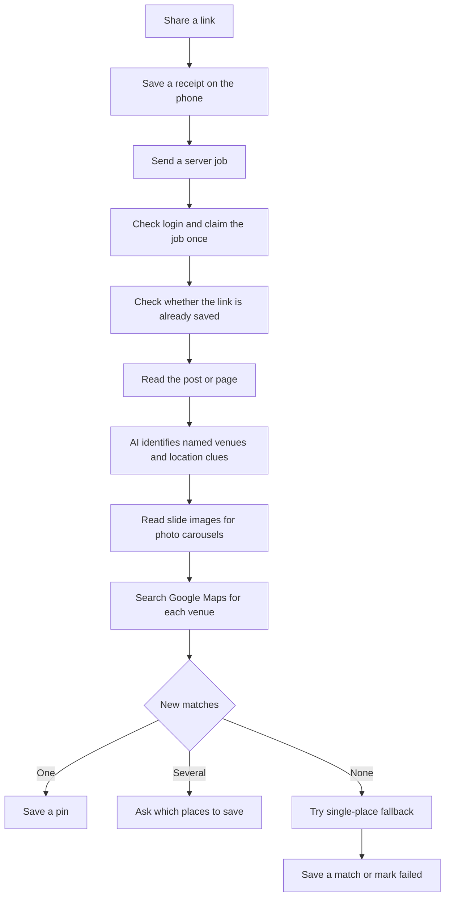

**Mapd link processor review — September 13, 2026**

This is the pre-implementation snapshot. See the [execution status and updated flow](/Users/alexlin/workspace/mapd-server/docs/engine-implementation-plan-2026-09-13.md) and [adversarial implementation review](/Users/alexlin/workspace/mapd-server/docs/engine-adversarial-review-2026-09-14.md) for the subsequent fixes.

The two reported posts contain named places. Their production jobs show failures while retrieving Instagram content, followed by Mapd reporting “No places could be extracted.” There are also independently reproducible defects in caching, parsing, and matching. Improving retrieval and fixing these defects should precede changing the AI model.

This review read production job records, inspected the app and server, fetched each reported caption once using the existing reader on this computer, and ran isolated reproductions plus existing tests. It did not modify production records, re-enrich your pins, or deploy changes. Successful caption retrieval here does not establish that Render can retrieve the same page, or that the complete live AI/Google pipeline would succeed today.

**Retry policy — updated at your request**

Once an attempt is marked failed, it must remain stopped. Only an explicit Retry creates a fresh attempt; X dismisses the old attempt persistently. App reopening, reconnection, background workers and provider cooldown expiry must never restart a failed attempt. Bounded delivery retries may occur while an attempt is still active, but must stop when it becomes terminal. A late result from work already accepted by the server is reconciliation, not permission to reprocess; it must not resurrect a dismissed Activity card.

**What happened to your examples**

| Link | Recorded attempt, UTC | Production evidence | Caption recovered locally during this review |
|---|---|---|---|
| [Kyoto Reel](https://www.instagram.com/reel/DdN24_ZvoSF/) | September 13, 15:48 | Reel reader found no usable preview metadata; yt-dlp fallback reported platform blocking. Final job message said no places. | Tai Sushi, Kyoto; a street address is present. |
| [Taipei Reel](https://www.instagram.com/reel/DcrAZqmybE4/) | September 8, 16:11 | Reel request returned Instagram HTTP 429; yt-dlp also returned HTTP 429. Final job message said no places. | Xiao Wu, Jian Hong, and Fu Hong beef-noodle shops, with Taipei location context. |

Both jobs reached the server. Their saved share text contained only the URL, so it could not rescue a failed caption download. The Kyoto job was claimed through the phone request; the Taipei job through the Cloud Function. This places the observed failures after share delivery and authentication. The original Kyoto response body was not retained: “no metadata” alone cannot distinguish a login/challenge page from HTML format drift.

**The recent increase is visible, but its cause cannot be assigned to an Android build.** The bounded account query returned 283 stored jobs, fewer than the 300-job limit. For Instagram, using UTC dates:

| Period | Shares | Failed jobs | Failure proportion | Failed jobs containing an explicit blocking/rate-limit stage |
|---|---:|---:|---:|---:|
| September 8–10 | 31 | 8 | 26% | 5 of 8 |
| September 11–13, through the review | 21 | 12 | 57% | 11 of 12 |

These are job attempts, including reshares and duplicate outcomes, not a controlled sample of unique videos. The windows are small and use different content. Failure stages are not exhaustive. Seven failures were already recorded on September 1, before the recent Android fixes. Job records do not include the installed app version or engine revision, limiting release attribution.

The recent cold-start, keyboard, and import-note commits did not edit the server extractor or AI prompts. GitHub's server main branch was still at `16a62c3` when checked. Local server HEAD `1a21ce2` adds thumbnail persistence; its `enrich.js` difference is an import and one image-persistence call. The exact Render image revision was not independently retrieved. The two observed failures specifically show content retrieval problems, not thumbnail persistence failures.

**The current processing flow**

Existing-place matches attach the new link to the saved pin. Google Maps links have an earlier direct place-resolution route and normally bypass social extraction and AI. Some individual venues can fail inside a multi-place post while other venues succeed; the current app does not clearly report those missing venues.

| Stage | What the code actually does |
|---|---|
| Receipt and dispatch | SQLite retains the shared URL and any accompanying text. The phone and, when enabled, a Cloud Function can submit the same job. A transaction allows one execution. Live configuration enables the Cloud Function; server enrichment defaults on and local fallback defaults off. |
| Initial duplicate check | The app checks its saved pins. The server checks the primary URL. A later content-ID check happens after social extraction. |
| Instagram Reel | Read preview metadata from the canonical Reel page. If that fails, try yt-dlp. If that fails, try generic page metadata. These are successive requests, not a scheduled cooldown. |
| Instagram photo post | Read the embedded post/carousel; fall back to yt-dlp and then generic metadata. |
| TikTok | Photo posts use a custom reader. Video posts use yt-dlp, which also tries available subtitles. |
| YouTube and ordinary pages | The normal server path uses generic page metadata. YouTube is not included in the `isSocial` condition that invokes yt-dlp here. |
| Text AI | Haiku receives title, up to 1,200 caption characters, hashtags, uploader, some mentions, and subtitles when available. It returns venue names, cities and addresses. |
| Image AI | Photo carousels with at least two slide images get a vision pass, up to 20 images, even when caption AI already found a venue. This can discover additional places on later slides. |
| Candidate matching | Merge extracted names, search Google for each, take the first result, and fetch its details. The main route stamps a fixed confidence score of 85. |
| Save | One new candidate saves automatically; multiple new candidates go to selection. Existing places receive the source link. Pin creation uses transactional deduplication. |
| Fallback | With no usable new candidate, try single-place AI, location-pin markers and text heuristics, then Google search and a separate confidence/verification calculation. |
| Failure reporting | Several unrelated problems collapse into `failed`. The client labels server failures as `extraction_failed`, and Activity displays “Couldn't find a place — tap to name it.” |

For most Instagram Reels, the normal successful reader supplies a caption and thumbnail, with `subtitles: null` and `is_carousel: false`. It does not examine video frames or listen to the voiceover. A venue mentioned only there can be missed even when downloading the caption succeeds. See [Reel output](/Users/alexlin/workspace/mapd-server/lib/instagramReel.js:134) and [vision trigger](/Users/alexlin/workspace/mapd-server/enrich.js:775).

Google import-note attachment is a separate path. It saves URLs as sources on already identified places and does not run this AI pipeline.

**Confirmed findings, in priority order**

1. **P1 — Temporary access failures become permanent-looking “no place” failures.** This is confirmed in both production examples. The social reader records its failures but continues with empty metadata. Google and AI helpers also return empty results for dependency errors. The server then emits a generic failure, and the app discards the distinction between blocked content, invalid AI output, unavailable Google data, and a readable post that truly names no venue. Preserve typed outcomes through the entire path and reserve “no named place” for a successfully read and evaluated post. [Server verdict](/Users/alexlin/workspace/mapd-server/enrich.js:1136), [client mapping](/Users/alexlin/workspace/mapd/src/services/enrichmentJobsListener.ts:258), [Activity wording](/Users/alexlin/workspace/mapd/src/screens/ActivityScreen.tsx:470).

2. **P1 — Different captions can receive the same cached AI answer.** The cache key uses only the first 50 title characters, first 50 caption characters and first 30 subtitle characters. It omits other prompt inputs such as uploader and hashtags. An isolated test used captions with identical introductions, with a named restaurant appearing only in the second caption. The second request returned the first cached empty result without calling AI. Hash the complete normalized prompt inputs and include model/prompt/schema versions. This defect is reproducible; these two production failures do not prove it was their trigger. [Cache key](/Users/alexlin/workspace/mapd-server/enrich/ai.js:136).

3. **P1 — Invalid or truncated AI output is cached as a successful empty answer.** If JSON parsing fails, the multi-place helper manufactures an empty list and caches it. A reproduction returned a truncated response with `stop_reason: max_tokens`; a repeated request reused the empty result. Validate the response shape and stop reason. Do not cache a processing error as evidence that no venue exists. If the attempt is marked failed, stop and offer user-controlled Retry; do not schedule another attempt automatically. Exceptions also lose their failure classification, although that catch branch itself does not cache. [Parsing and caching](/Users/alexlin/workspace/mapd-server/enrich/ai.js:184).

4. **P1 — Matching rules can both miss correct places and accept wrong ones.** In a reproduction, Tai Sushi named in the caption but absent from the title scored 20, below the fallback's 30-point threshold. A positive AI verification did not change that score, so the correct match was rejected. Separately, a mocked first Google result in Miami was accepted for a Kyoto query with fixed confidence 85. Use one evidence-based ranking system for both paths: name, address, city/country and supporting text. Accepting a plausible candidate should not depend on which fallback found it. An AI verifier's own failures must remain “unknown,” not be treated as positive verification. [Caption scoring](/Users/alexlin/workspace/mapd-server/enrich/confidence.js:14), [verification handling](/Users/alexlin/workspace/mapd-server/enrich.js:885), [first-result selection](/Users/alexlin/workspace/mapd-server/enrich.js:815).

5. **P2 — The normal processing route bypasses the shared extraction cache.** `/extract` caches metadata, but `/enrich` calls the readers directly. Two simulated unresolved shares of the same post caused two reader calls. There is also route drift: `/extract` lacks the specialized Reel branch that `/enrich` has. Use one extraction service with a successful-content cache and shared in-flight work keyed by platform/content ID. An existing per-job claim prevents duplicate execution of one job; it does not combine different jobs for the same video. [Cached endpoint](/Users/alexlin/workspace/mapd-server/index.js:340), [direct calls](/Users/alexlin/workspace/mapd-server/enrich.js:699).

6. **P2 — Failure recovery needs an explicit user-controlled retry.** The Cloud Function retries trouble delivering a job to Mapd. Once Mapd accepts with HTTP 202, the Function completes; an Instagram 429 later inside the worker does not trigger that delivery retry. Failed job IDs are terminal to the claim function, and the sweeper marks abandoned work failed rather than reprocessing it. Keep failed job IDs terminal. Add an explicit Retry action that persists a new job ID, and an X action that permanently dismisses the old card. Provider-wide concurrency limits and cooldowns should govern active requests and newly requested retries; cooldown expiry must not restart failed jobs. Respect `Retry-After` when supplied; a 429 is a rate-limit response, not a verdict on the video. [Function boundary](/Users/alexlin/workspace/mapd-server/functions/index.js:122), [terminal claim](/Users/alexlin/workspace/mapd-server/lib/enrichClaim.js:55), [HTTP specification](https://www.rfc-editor.org/rfc/rfc6585.html#section-4).

7. **P2 — Some available evidence is discarded or parsed incorrectly.** An existing extracted description overrides accompanying shared text instead of combining distinct evidence; a reproduction confirmed the named venue in shared text never reached AI. The generic metadata parser also cuts a double-quoted caption at a raw apostrophe: “Don't miss Tai Sushi in Kyoto” became “Don.” The specialized Reel parser assumes exact attribute ordering and quoting. Preserve distinct text signals, strip URL-only share text, use a robust metadata parser, and prioritize explicit venue/address lines when limiting long captions. [Text selection](/Users/alexlin/workspace/mapd-server/enrich.js:733), [generic parser](/Users/alexlin/workspace/mapd-server/enrich/ogMetadata.js:25), [Reel parser](/Users/alexlin/workspace/mapd-server/lib/instagramReel.js:104).

8. **P2 — Failure to load extra details discards a matched place.** A name, place ID and coordinates can already be available from Google search. If the details call then fails, the main loop drops the candidate. This was reproduced with a valid search result and missing details. Retain the basic match, distinguish an unavailable details request from a nonexistent place, and fill in opening hours and other extras later. The pin builder already supports partial details on other paths. [Discard](/Users/alexlin/workspace/mapd-server/enrich.js:827), [details error](/Users/alexlin/workspace/mapd-server/enrich/places.js:380).

9. **P2 — Multi-place information can disappear.** Candidates are deduplicated by normalized name without location: two same-name branches in Kyoto and Osaka collapsed into one in a reproduction. In addition, when one of several venues resolves, the one-candidate branch can save it without reporting the unresolved others. Include geography in identity until Google place IDs are available, then deduplicate by place ID; expose partial success. [Merge](/Users/alexlin/workspace/mapd-server/enrich.js:797).

10. **P2 — Extractor maintenance and cache expiry need attention.** September 12 production errors still identify yt-dlp `2026.03.17`. The latest stable release page checked during this review showed `2026.08.19`. Rebuild with a tested version and make that version visible in diagnostics; updating alone does not guarantee Instagram access. The local memory cache also ignores custom TTLs and always uses 24 hours, so reusing that helper for a short provider cooldown would keep the wrong expiry unless fixed. The `stkn` parameter in both supplied URLs is not removed by current URL cache normalization; content-ID keys avoid splitting such variants. [Cache expiry](/Users/alexlin/workspace/mapd-server/lib/cache.js:33), [URL normalization](/Users/alexlin/workspace/mapd-server/lib/cache.js:56), [yt-dlp release](https://github.com/yt-dlp/yt-dlp/releases/tag/2026.08.19), [maintainer update guidance](https://github.com/yt-dlp/yt-dlp/blob/master/README.md).

**Recommended implementation order**

| Order | Work | How to judge success |
|---|---|---|
| 1 | Correct failure categories; shared extraction service/cache; user-controlled Retry/X and provider cooldown; tested extractor update. | A blocked post stops and is accurately labeled. Only Retry starts another attempt; X remains dismissed after restart. Concurrent shares of one post reuse its extraction. |
| 2 | Full-input AI cache keys, response validation, metadata parsing, shared-text preservation. | Different captions cannot share answers accidentally; malformed output is reported honestly and can be retried by the user; supplied venue text reaches the model. |
| 3 | Unified Google result ranking, geography/native-name context, partial-detail saves and partial multi-place outcomes. | The Kyoto test selects a Kyoto venue; an unrelated Miami result is rejected; matched venues survive details outages. |
| 4 | Targeted video-frame text reading and audio transcription when caption evidence is insufficient and media is available. Preserve the current carousel pass for posts that may name additional venues on slides. | Voiceover-only and on-screen-only examples improve without doing costly media work on every ordinary caption-based share. |
| 5 | A repeatable evaluation set and diagnostics for each release. | Measure content retrieval, venue extraction, correct Google matches, missed venues, wrong pins, time to result and cost per successful result separately. |

For geographic matching, Google supports explicit text location and location bias. These should follow the post's destination context; a travel-saving user's current/home city should not silently override the destination. Use constraints appropriate to the search type and compare returned addresses. [Google Text Search documentation](https://developers.google.com/maps/documentation/places/web-service/text-search).

At larger scale, combine successful public-post extraction across users while keeping their saved pins and private notes separate. A worker queue with shared per-provider limits controls request bursts. Cache validated caption/place results, combine simultaneous requests for the same content, and bound each active attempt. Once an attempt fails, leave it stopped until the user explicitly requests another; provider cooldown expiry must never resume failed jobs. Additional server instances alone would not solve a provider access limit. Media processing should have time, byte and concurrency bounds; the current carousel fetch uses an unbounded wait per image and fetches up to 20 in parallel.

Create a small labeled evaluation set containing readable successful posts, these two failures, ambiguous chain names, non-English names, long captions, multi-place posts, carousels and videos with audio/on-screen-only venue names. Keep a held-out portion. Track precision as well as successful-save rate so an apparent improvement does not come from saving more wrong places. Record engine/app/extractor versions, stage durations, cache hits, signal availability and typed errors. The existing logs cannot attribute failures without explicit stage failures to AI, parsing or Google reliably.

**Validation and review limits**

The existing server suite passed: 544 tests in 44 suites. The selected app share-delivery and job-listener checks passed: 32 tests in 4 suites. Seven isolated reproduction scenarios ran against actual loaded modules with substitute dependencies; an eighth check demonstrated same-name/different-city merging. They reproduced the current defects rather than repairing them. No paid end-to-end AI or Places calls were made. No physical Android test was performed. Production HTML and complete intermediate AI/search results were unavailable for retrospective inspection.

Correctness needs changes in the areas above. Performance needs shared extraction and bounded outbound work. Maintainability would benefit from removing duplicate extraction/prompt paths so fixes reach the normal server route. The authentication and per-job transactional claim are useful existing protections, and pin-write deduplication is worth retaining; this was not a comprehensive new security audit. The existing carousel pass and preservation of new sources on already saved places provide useful foundations for improving recall without duplicating pins.
